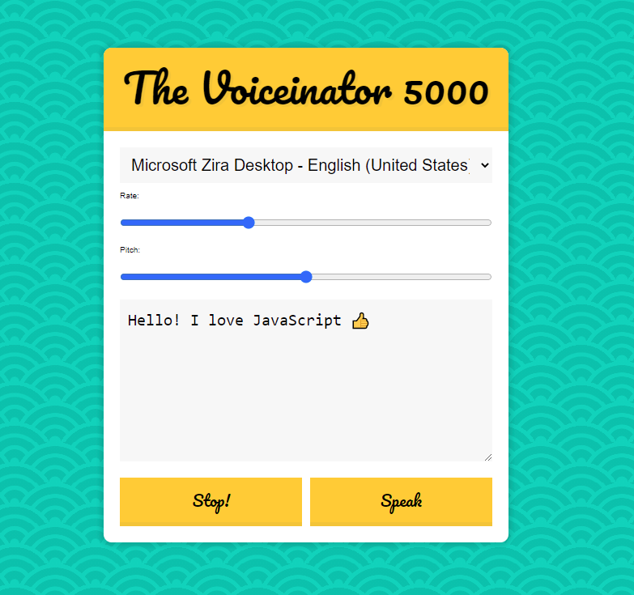

# 23 - Text To Speech

**Challenge:** Work with Speech Synthesis API that comes in most modern browsers. Convert text to voice.

**Things to Learn:** Using SpeechSynthesisUtterance interface, cancel and speak methods, voiceschanged event.

[DEMO](https://voloshin-sergei.github.io/30DaysOfJavaScript/23_day%20Text%20To%20Speech/)
