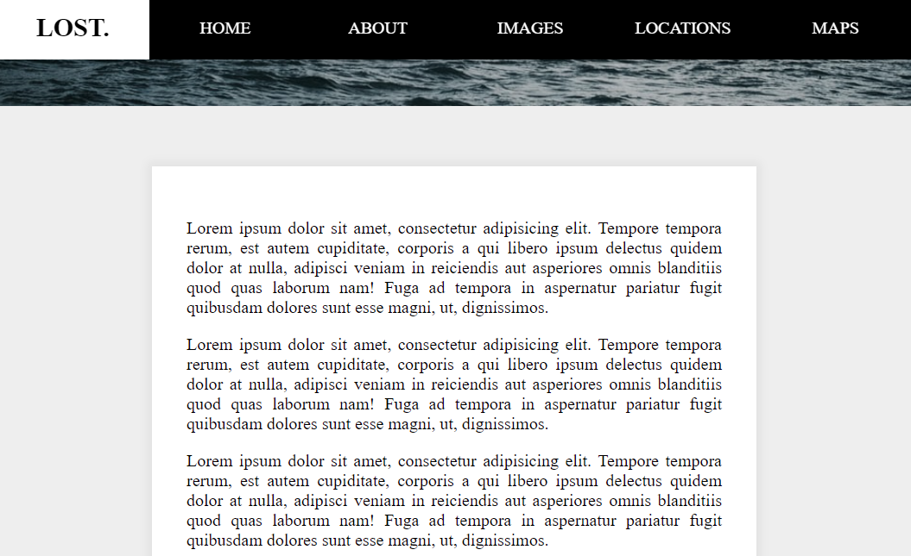

# 24 - Sticky Nav

**Challenge:** As soon as the navigation bar reaches the top of the browser window on scrolling, it fixed over the content of the page. And also the logo scroll out from the left.

**Things to Learn:** window scroll event, css property position:fixed.

[DEMO](https://voloshin-sergei.github.io/30DaysOfJavaScript/24_day%20Sticky%20Nav/)
