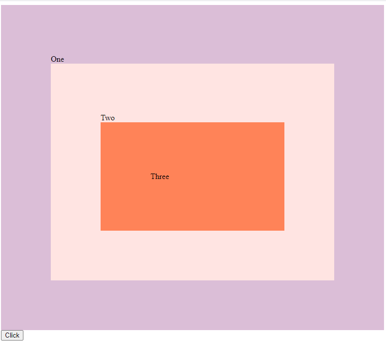

# 25 - JavaScript Event Capture

**Challenge:** Learn about event capturing.

**Things to Learn:** bubbling, propagation, property called once.

[DEMO](https://voloshin-sergei.github.io/30DaysOfJavaScript/25_day%20JavaScript%20Event%20Capture/)
