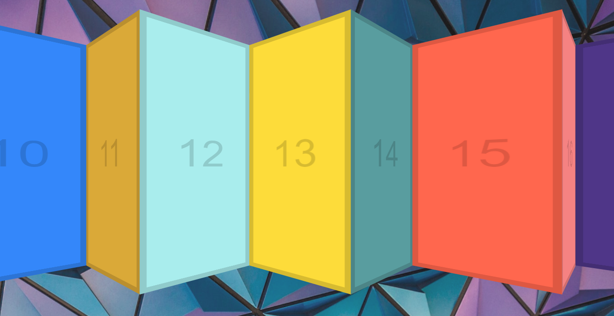

# 27 - Click and Drag

**Challenge:** Сlick and drag the mouse, the slider will follow its movement to the left or right.

**Things to Learn:** mousedown, mouseleave, mouseout, mouseup and mousemove events. Calculation of mouse movements.

[DEMO](https://voloshin-sergei.github.io/30DaysOfJavaScript/27_day%20Click%20and%20Drag/)
