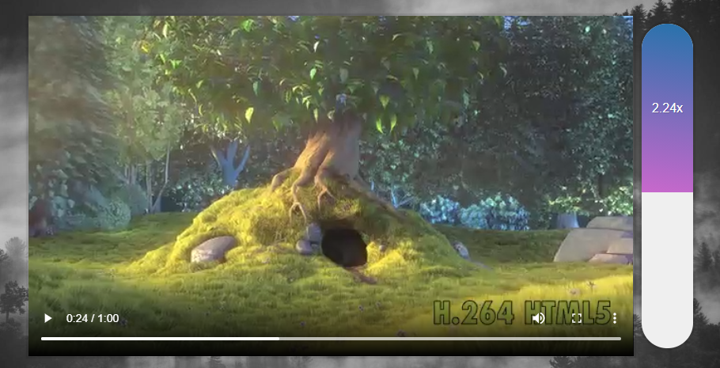

# 28 - Video Speed Controller

**Challenge:** A custom video speed slider that tracks mouse movement, allowing you to change the video playback speed.

**Things to Learn:** mousemove events, HTML5 video, toFixed method.

[DEMO](https://voloshin-sergei.github.io/30DaysOfJavaScript/28_day%20Video%20Speed%20Controller/)
