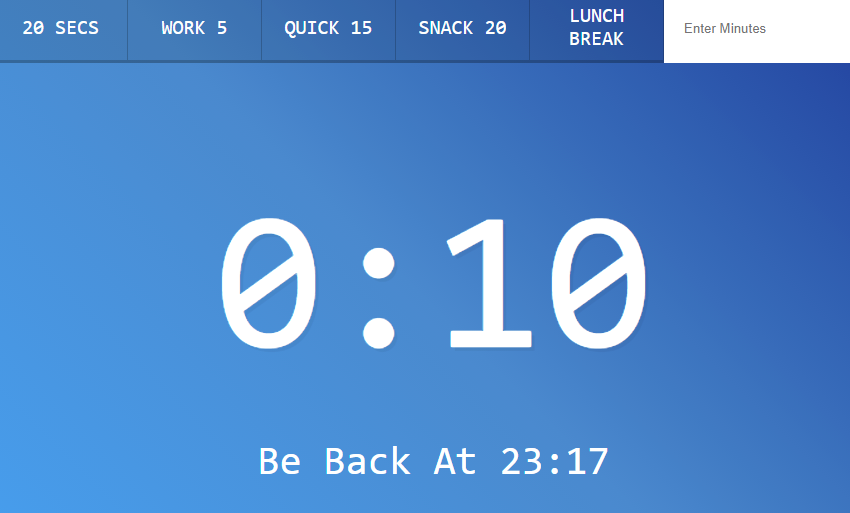

# 29 - Countdown Timer

**Challenge:** Сreating a countdown timer. You can choose a set time or enter your own.

**Things to Learn:** setInterval, clearInterval, select element using name attribute.

[DEMO](https://voloshin-sergei.github.io/30DaysOfJavaScript/29_day%20Countdown%20Timer/)
