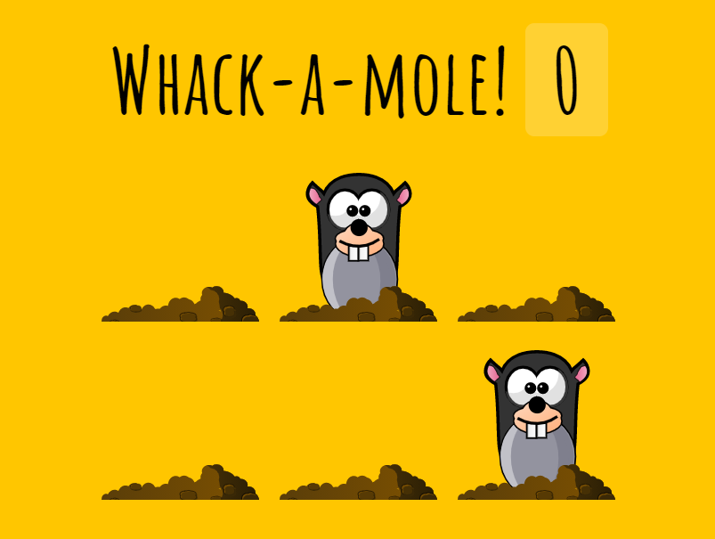

# 30 - Mole Game

**Challenge:** Build a game Whack-a-mole. The game lasts 10 seconds, moles appear in a random order, for a random time, from 200 to 1000 milliseconds. If you successfully click on the mole, you will get a point.

**Things to Learn:** setTimeout(), e.isTrusted and how to set random time.

[DEMO](https://voloshin-sergei.github.io/30DaysOfJavaScript/30_day%20Mole%20Game/)
